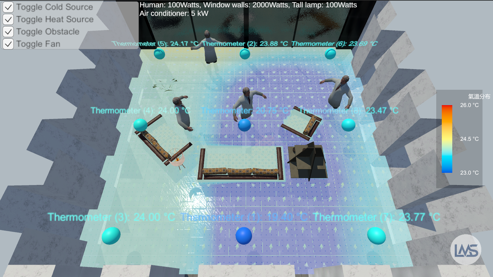
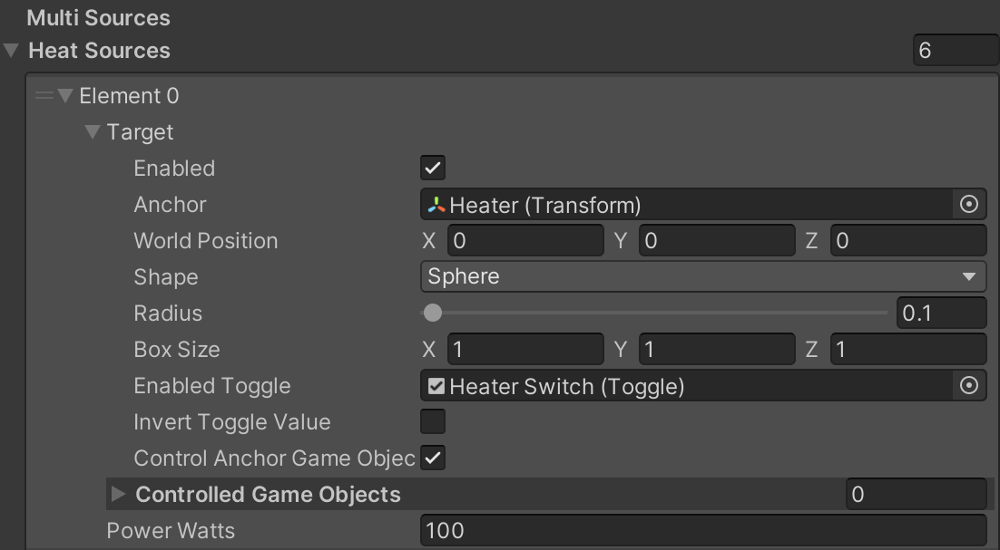
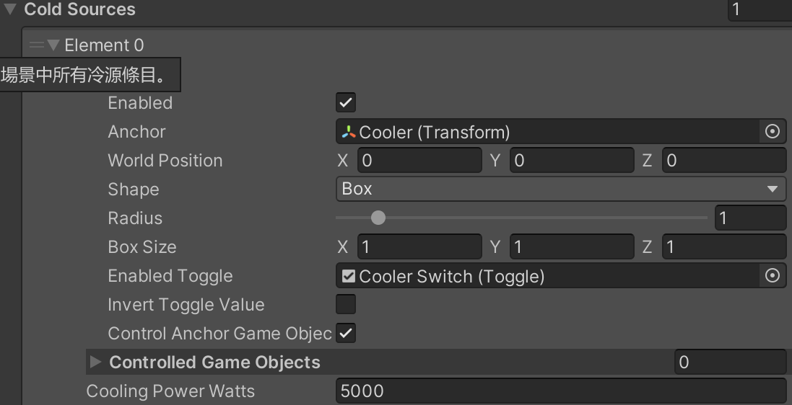
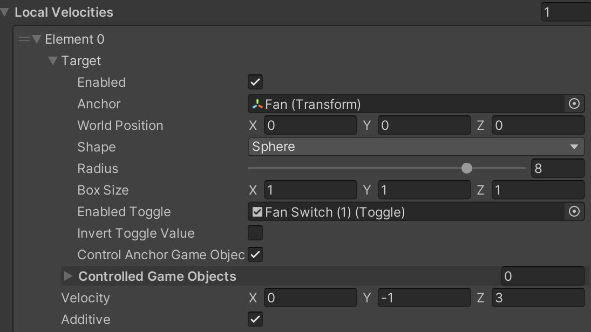
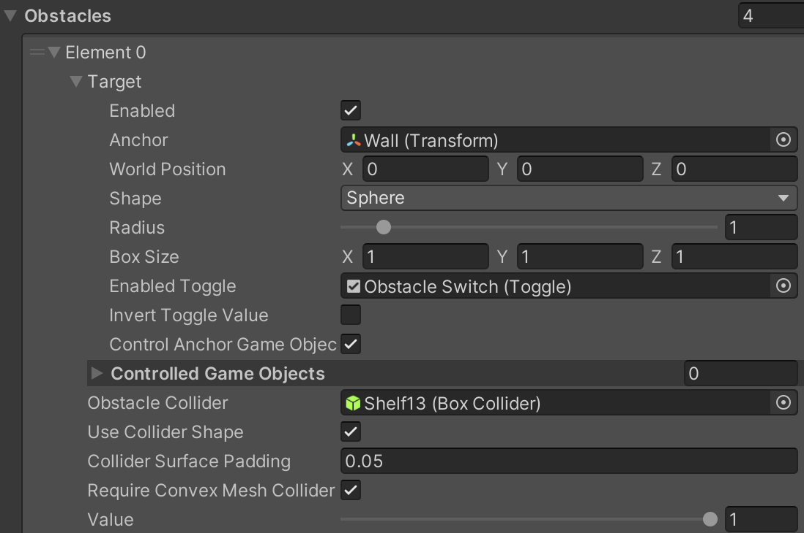

# General 3D Spatial Thermal Flow Simulator

> 通用三維空間熱流模擬器之設計與實作  
> Design and Implementation of a General 3D Spatial Thermal Flow Simulator

本專案是一套以 **Unity** 為核心開發的三維空間熱流模擬系統，透過 **Compute Shader、3D RenderTexture、Voxel Grid、半拉格朗日法、壓力場求解與不可壓縮流體壓力投影**，即時模擬與視覺化任意三維空間中的溫度分布與氣流變化。

系統最初以教室場景為展示案例，後續擴充為可套用於一般三維空間的熱流模擬平台，可應用於：

- 智慧建築熱環境展示
- 空調送風與回風配置分析
- 無塵室氣流展示
- 辦公室、教室、實驗室與機房熱分布觀察
- 設備散熱與局部熱點分析
- 數位孿生空間視覺化
- Unity 教學與互動式工程展示

> 本系統目標為 **即時互動展示與基礎物理合理性**，並非取代工程級 CFD 軟體。

---

## Preview

> 專案截圖。


[](https://www.youtube.com/watch?v=k-5ruIngDR4 "Unity熱流模擬軟體第一版")

---

## Key Features

- **通用三維空間模擬**  
  不限於教室，可建立辦公室、無塵室、機房、實驗室、設備艙體等封閉或半封閉空間。

- **Voxel Grid 空間離散**  
  將空間切分為三維格點，每個 voxel 儲存溫度、速度、壓力、散度、熱源與障礙物資訊。

- **GPU 平行運算**  
  使用 Unity Compute Shader 在 GPU 上更新三維溫度場與速度場。

- **功率型熱源與冷源**  
  支援以瓦特 `W` 設定熱源或冷源，再依空氣密度、比熱與受影響體積換算為溫度變化率。

- **局部送風與回風模擬**  
  可在指定區域注入速度向量，用於模擬出風口、回風口、風扇或局部氣流。

- **基礎流體求解流程**  
  包含速度場平流、黏滯、阻尼、浮力、散度計算、壓力 Jacobi 迭代與壓力投影。

- **障礙物體素化**  
  支援球形、箱形與 Collider 近似障礙物，可用於牆壁、桌椅、設備、櫃體與管線。

- **切片式熱圖顯示**  
  可在水平剖面 `XZ`、前後剖面 `XY`、左右剖面 `YZ` 顯示溫度分布。

- **風場視覺化**  
  支援切片風向箭頭與 Gizmos 風場箭頭，可觀察速度場方向與強度。

- **AsyncGPUReadback 偵錯讀回**  
  可非同步讀回 GPU 中的速度場資料，用於風場偵錯與展示。

---

## System Architecture

系統主要分為六個模組：

| Module | Description |
|---|---|
| Scene Modeling | 建立三維空間、牆面、地板、天花板、家具、設備、出風口與回風口 |
| Thermal Field Simulation | 更新溫度場，包含熱擴散、功率型熱源/冷源、環境回拉與對流 |
| Velocity Field Simulation | 更新速度場，包含速度平流、黏滯、浮力、阻尼與壓力投影 |
| Environment Writer | 將熱源、冷源、局部風速與障礙物寫入三維場資料 |
| Visualization | 顯示熱圖切片、格線與風向箭頭 |
| Debug / Readback | 使用 AsyncGPUReadback 與 Gizmos 顯示風場資訊 |

---

## Core Data Fields

系統使用多組 3D RenderTexture 儲存模擬場資料：

| Field | Type | Purpose |
|---|---|---|
| `Temperature` | Scalar 3D Texture | 儲存三維溫度場 |
| `HeatSource` | Scalar 3D Texture | 儲存熱源與冷源項 |
| `Obstacle` | Scalar 3D Texture | 儲存障礙物遮罩 |
| `Velocity` | Vector 3D Texture | 儲存三維速度場 |
| `Pressure` | Scalar 3D Texture | 儲存壓力場 |
| `Divergence` | Scalar 3D Texture | 儲存速度場散度 |

溫度場、速度場與壓力場採用 **double buffer** 更新，以避免同一個運算步驟中同時讀寫造成資料衝突。

---

## Mathematical Model

### 1. Voxel Size

模擬空間尺寸為：

$$
L_x \times L_y \times L_z
$$

格點數量為：

$$
N_x \times N_y \times N_z
$$

單一 voxel 尺寸為：

$$
\Delta x = \frac{L_x}{N_x}, \quad
\Delta y = \frac{L_y}{N_y}, \quad
\Delta z = \frac{L_z}{N_z}
$$

單一 voxel 體積為：

$$
V_{cell}=\Delta x \Delta y \Delta z
$$

---

### 2. Heat Conduction

基礎熱傳導模型為：

$$
\frac{\partial T}{\partial t}=\alpha \nabla^2T+S_T
$$

其中：

| Symbol | Meaning |
|---|---|
| `T` | 溫度 |
| `α` | 熱擴散係數 |
| `∇²T` | 溫度場拉普拉斯項 |
| `S_T` | 熱源或冷源造成的溫度變化率 |

離散更新形式：

$$
T_{diff}=T+\Delta t\alpha\nabla^2T
$$

---

### 3. Power-Based Heat Source / Cooling Source

熱源或冷源以功率輸入：

$$
S_T=\frac{\dot Q}{\rho c_p V}
$$

其中：

| Symbol | Meaning |
|---|---|
| `Q̇` | 輸入熱功率或冷卻功率，單位 W |
| `ρ` | 空氣密度 |
| `c_p` | 空氣定壓比熱 |
| `V` | 受影響體積 |
| `S_T` | 溫度變化率，單位 K/s |

當 `S_T > 0` 表示升溫；當 `S_T < 0` 表示降溫。

---

### 4. Advection-Diffusion

加入速度場後，溫度場受到氣流搬運：

$$
\frac{\partial T}{\partial t}+\mathbf{v}\cdot\nabla T
=\alpha\nabla^2T+S_T
$$

系統採用半拉格朗日法反向追蹤來源位置：

$$
\mathbf{p}_{prev}=\mathbf{p}-\Delta t(\mathbf{v}\oslash\mathbf{h})
$$

再以三線性插值取得來源位置溫度：

$$
T_{adv}(\mathbf{p})=T(\mathbf{p}_{prev})
$$

---

### 5. Diffusion-Advection Mixing

為兼顧即時性與穩定性，系統可將擴散結果與對流結果混合：

$$
T_{mix}=(1-\lambda)T_{diff}+\lambda T_{adv}
$$

其中 `λ` 為混合權重。此設計主要用於即時展示中的數值控制，並非完整工程級 CFD 離散式。

---

### 6. Momentum Equation

速度場更新參考 Navier-Stokes 動量方程式：

$$
\frac{\partial \mathbf{v}}{\partial t}
+(\mathbf{v}\cdot\nabla)\mathbf{v}
=-\nabla p+\nu\nabla^2\mathbf{v}+\mathbf{F}
$$

為符合即時模擬需求，系統將速度更新簡化為：

$$
\mathbf{v}^{*}=Advection(\mathbf{v})+\Delta t(\nu\nabla^2\mathbf{v}+\mathbf{F}_{buoyancy})
$$

並加入阻尼：

$$ 
\mathbf{v}^* = \mathbf{v}^*(1 - d\Delta t)
$$

---

### 7. Buoyancy Approximation

熱浮力使用簡化 Boussinesq 近似：

$$
\mathbf{F}_{buoyancy}=(0,g\beta(T-T_{amb}),0)
$$

理想氣體下：

$$
\beta \approx \frac{1}{T_{amb}+273.15}
$$

---

### 8. Incompressible Pressure Projection

不可壓縮條件：

$$
\nabla\cdot\mathbf{v}=0
$$

速度場經過平流、浮力與外部速度注入後，會先得到中間速度場 `v*`，再求解壓力 Poisson 方程：

$$
\nabla^2p=\nabla\cdot\mathbf{v}^{*}
$$

最後以壓力梯度修正速度場：

$$
\mathbf{v}_{projected}=\mathbf{v}^{*}-\nabla p
$$

---

### 9. Jacobi Pressure Solver

等距網格下，壓力 Jacobi 迭代可寫為：

$$
p_{new}=\frac{p_L+p_R+p_D+p_U+p_B+p_F-div}{6}
$$

非等距網格下可使用加權形式：

$$
p_{new}=\frac{\sum_i w_i p_i-div}{\sum_i w_i}
$$

其中：

$$
w_x=\frac{1}{\Delta x^2}, \quad
w_y=\frac{1}{\Delta y^2}, \quad
w_z=\frac{1}{\Delta z^2}
$$

---

## Compute Shader Kernels

`HeatSimulation.compute` 包含以下主要 kernel：

| Kernel | Purpose |
|---|---|
| `HeatStep` | 熱擴散、溫度平流、熱源/冷源加入、環境回拉與溫度限制 |
| `VelocityStep` | 速度平流、黏滯、浮力、阻尼與速度限制 |
| `ComputeDivergence` | 計算速度場散度 |
| `PressureJacobi` | 使用 Jacobi 迭代求解壓力場 |
| `ProjectVelocity` | 以壓力梯度修正速度場 |
| `ClearFloat3D` | 清空標量 3D 場資料 |
| `FillTemperature` | 初始化環境溫度 |
| `FillVelocity` | 初始化或設定全域基礎風速 |
| `PaintSphereFloat` | 將標量值寫入球形區域 |
| `PaintSphereFloat4` | 將速度向量寫入球形區域 |
| `PaintCellsFloat` | 將標量值寫入指定 voxel 集合 |
| `PaintCellsFloat4` | 將速度向量寫入指定 voxel 集合 |
| `ReduceAbsMaxFloat3D` | 估計散度最大絕對值，用於壓力投影收斂檢查 |

---

## Main Scripts

| Script | Description |
|---|---|
| `ClassroomHeatSimulation.cs` | 系統主控腳本，負責初始化 RenderTexture、更新模擬、管理 Compute Shader 與場資料 |
| `HeatSlicePlaneController.cs` | 控制熱圖切片位置、方向與顯示參數 |
| `HeatWindMapVisualizer.cs` | 使用 AsyncGPUReadback 讀回速度場並以 Gizmos 顯示風向 |
| `HeatTestDriver.cs` | 測試用腳本，可快速建立熱源、冷源、送風與展示情境 |
| `HeatSimulation.compute` | 核心 GPU 模擬運算 |
| `HeatSliceDisplay.shader` | 熱圖切片顯示、格線與風向箭頭視覺化 |

> `ClassroomHeatSimulation.cs` 仍保留原始命名以維持專案相容性，但功能已抽象為通用三維空間熱流模擬主控器。

---

## Requirements

- Unity `2021.3.30f1` 或相容版本
- 支援 Compute Shader 的 GPU
- 支援 3D RenderTexture 與 random write
- Windows / macOS / Linux 依 Unity Compute Shader 支援狀況而定

建議硬體：

- GPU：支援 DirectX 11 / Metal / Vulkan Compute
- VRAM：建議 4GB 以上
- RAM：建議 16GB 以上

---

## Installation

1. Clone this repository:

```bash
git clone https://github.com/SR-Leader-Class/General-3D-Spatial-Thermal-Flow-Simulator.git
```

2. Open the project with Unity.

3. Confirm that the project contains:

```text
Assets/
├── Scripts/
│   ├── ClassroomHeatSimulation.cs
│   ├── HeatSlicePlaneController.cs
│   ├── HeatWindMapVisualizer.cs
│   └── HeatTestDriver.cs
├── Shaders/
│   ├── HeatSimulation.compute
│   └── HeatSliceDisplay.shader
└── Scenes/
    └── SampleScene.unity
```

4. Open the sample scene.

5. Press `Play` to start the simulation.

---

## Quick Start

### 1. Add Main Simulator

Create an empty GameObject and attach:

```text
ClassroomHeatSimulation.cs
```

Configure basic simulation volume:

```text
Simulation Size: 5m x 3m x 5m
Grid Resolution: 64 x 36 x 64
Ambient Temperature: 26°C
```

---

### 2. Add Thermal Slice Plane

Create a plane object and attach:

```text
HeatSlicePlaneController.cs
```

Select slice mode:

```text
XZ: horizontal slice
XY: front/back slice
YZ: left/right slice
```

Assign material using:

```text
HeatSliceDisplay.shader
```

---

### 3. Add Heat Source / Cooling Source

Use a test driver or custom script to add sources.

Example concepts:




> Actual method names may vary according to the implementation version.

---

### 4. Add Local Airflow

Use a velocity injection area to simulate supply air or return air:



---

### 5. Add Obstacles

Use box, sphere, or Collider voxelization to mark solid regions:



Obstacle voxels block heat and velocity updates in the simplified solid-wall model.

---

## Example Simulation Scenarios

### Scenario 1: Uniform Ambient State

Initial test state. The whole space is initialized to ambient temperature.

Purpose:

- Verify 3D temperature initialization
- Check slice visualization
- Confirm system stability

---

### Scenario 2: Human or Equipment Heat Sources

Add power-based heat sources around people, computers, lights, or devices.

Expected result:

- Local temperature rises near heat sources
- Heat spots become visible on thermal slices
- Heat intensity depends on power, volume, and air heat capacity

---

### Scenario 3: Cooling Source

Add cooling regions near air conditioners, cooling coils, or low-temperature zones.

Expected result:

- Low-temperature zone appears near the source
- Cold region expands or moves with airflow

---

### Scenario 4: Supply Air and Return Air

Inject local velocity vectors from supply vents and return vents.

Expected result:

- Temperature distribution shifts along airflow direction
- Cold or hot air is transported by convection
- Wind arrows show local flow direction

---

### Scenario 5: Obstacles and Equipment Blocking

Add walls, desks, cabinets, equipment, or partitions as voxel obstacles.

Expected result:

- Airflow is blocked or redirected
- Local heat stagnation may appear behind obstacles
- Cooling efficiency may decrease in blocked regions

---

### Scenario 6: Wind Field Visualization

Enable wind arrows on thermal slices or Gizmos.

Expected result:

- Observe airflow direction and approximate magnitude
- Check whether supply air reaches target areas
- Detect blocked or recirculating areas

---

## Important Parameters

| Parameter | Description |
|---|---|
| `gridResolution` | 三維格點解析度 |
| `simulationSize` | 模擬空間尺寸 |
| `ambientTemperature` | 環境基準溫度 |
| `thermalDiffusivity` | 熱擴散係數 |
| `airDensity` | 空氣密度 |
| `specificHeatCapacity` | 空氣定壓比熱 |
| `timeStep` | 模擬時間步長 |
| `advectionWeight` | 對流與擴散混合權重 |
| `velocityDamping` | 速度阻尼係數 |
| `viscosity` | 黏滯係數 |
| `buoyancyStrength` | 浮力影響強度 |
| `pressureIterations` | 壓力 Jacobi 迭代次數 |
| `maxTemperature` | 最高溫度限制 |
| `minTemperature` | 最低溫度限制 |
| `maxVelocity` | 最大速度限制 |
| `readbackInterval` | GPU 風場讀回間隔 |

---

## Limitations

本系統目前仍有以下限制：

- 尚未進行工程級 CFD 精度驗證
- 壓力場求解採有限次 Jacobi 迭代，精度受解析度與迭代次數影響
- 尚未加入完整湍流模型
- 尚未加入濕度、輻射換熱與污染物濃度模型
- 壁面與障礙物處理為 voxel mask 簡化近似
- Collider 體素化精度受格點解析度限制
- AsyncGPUReadback 若頻率過高仍可能造成效能負擔
- 尚未直接接入真實感測器資料
- 不應直接作為工程設計最終依據

---

## Future Work

- 整合溫濕度、CO₂、壓差與風速感測器
- 建立真實空間數位孿生資料流
- 加入 AI 或規則式 HVAC 控制策略
- 加入 FFU、Return Air、壓差與潔淨區模型
- 加入更完整的湍流、壁面邊界層與輻射換熱模型
- 與專業 CFD 或實測資料進行驗證
- 支援 VR / AR 沉浸式熱流展示
- 支援多空間比較與參數最佳化

---

## Suggested Repository Structure

```text
General-3D-Spatial-Thermal-Flow-Simulator/
├── Assets/
│   ├── Scripts/
│   │   ├── ClassroomHeatSimulation.cs
│   │   ├── HeatSlicePlaneController.cs
│   │   ├── HeatWindMapVisualizer.cs
│   │   └── HeatTestDriver.cs
│   ├── Shaders/
│   │   ├── HeatSimulation.compute
│   │   └── HeatSliceDisplay.shader
│   ├── Materials/
│   ├── Scenes/
│   └── Prefabs/
├── Docs/
│   └── Images/
├── README.md
└── LICENSE
```

---

## Academic Context

This project is based on the research topic:

**通用三維空間熱流模擬器之設計與實作**  
**Design and Implementation of a General 3D Spatial Thermal Flow Simulator**

The system demonstrates how Unity can be used not only as a game engine, but also as an interactive visualization platform for thermal-flow simulation, digital twin prototyping, HVAC concept testing, and educational demonstrations.

---

## References

The theoretical and implementation background of this project is related to:

- Heat conduction and sensible heat balance
- Stable fluids and semi-Lagrangian advection
- GPU-based fluid simulation
- Pressure projection for incompressible flow
- Unity Compute Shader and 3D RenderTexture
- AsyncGPUReadback-based GPU data readback
- Building thermal environment and CFD validation concepts

---

## Disclaimer

This project is designed for real-time visualization, educational demonstration, and early-stage spatial thermal-flow concept testing. It uses simplified numerical models to maintain interactive performance inside Unity.

It should not be used as a replacement for validated engineering CFD software when safety-critical, regulatory, or final engineering decisions are required.

---


## Author

- Research / Development: `蘇家賢`
- Institution: `National Taipei University of Technology`
- Project: `General 3D Spatial Thermal Flow Simulator`

